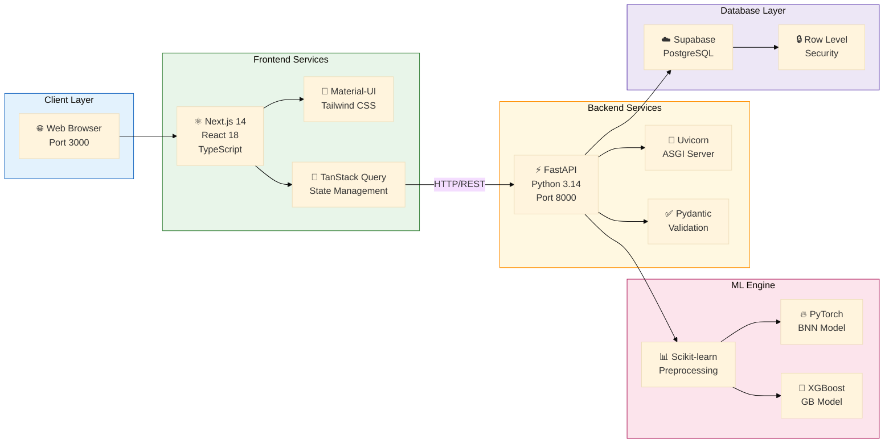
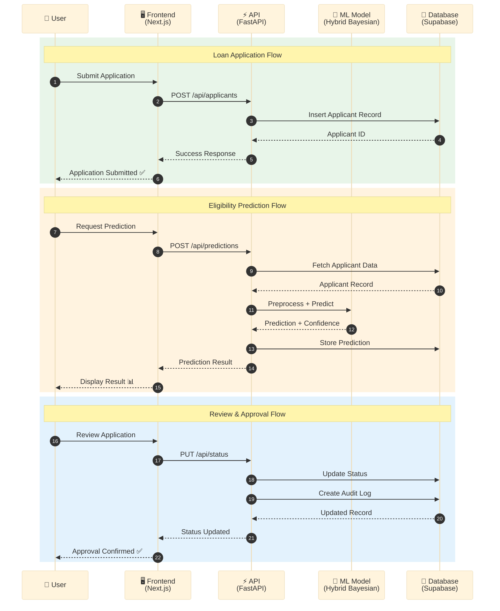
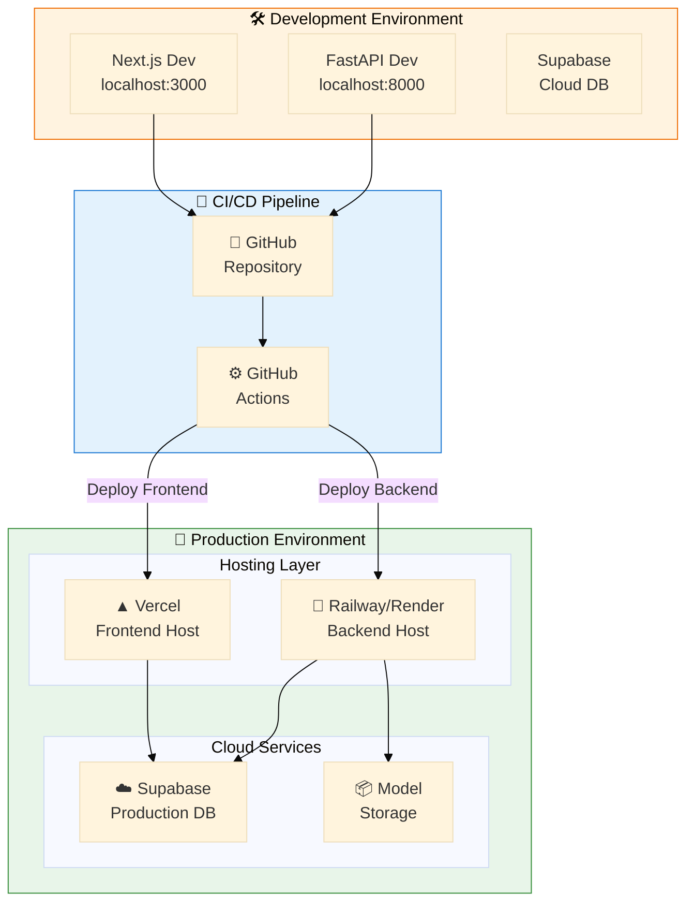
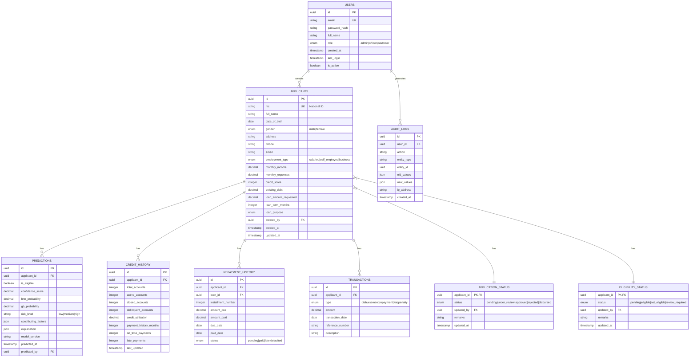
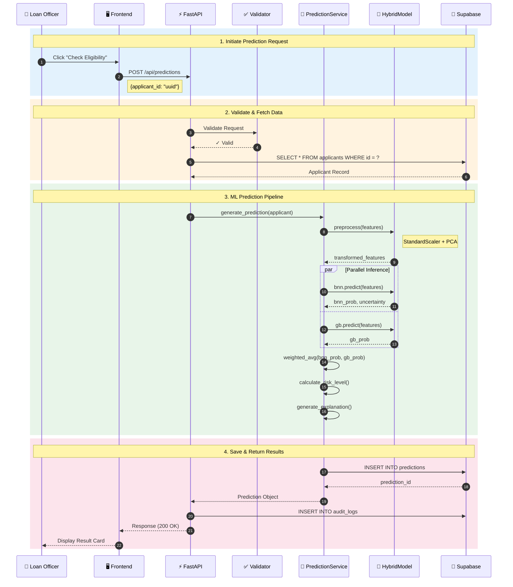
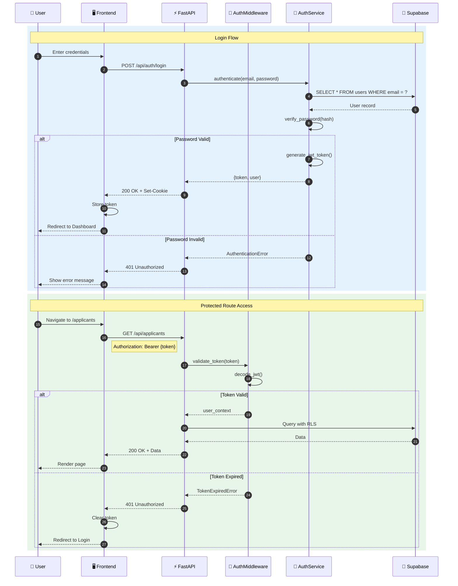
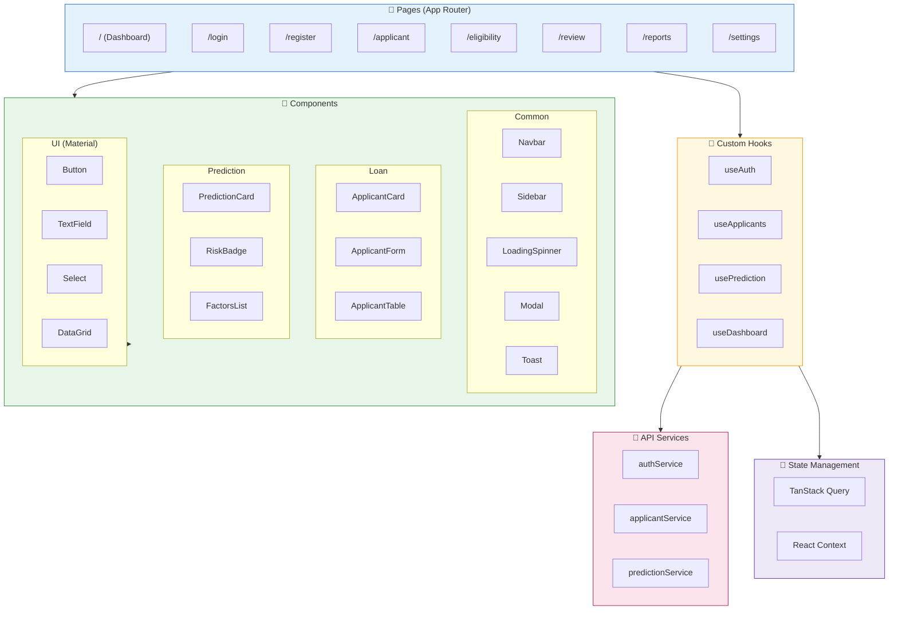

# LoanWise System Architecture

> **Document Version:** 2.0  
> **Last Updated:** February 2026  
> **Project:** Loan Evaluation System - Final Year Project

---

## 📊 Visual Architecture Diagram (Mermaid)

The following diagram can be rendered in VS Code (with Mermaid extension), GitHub, or [Mermaid Live Editor](https://mermaid.live).

```mermaid
%%{init: {'theme': 'base', 'themeVariables': { 'primaryColor': '#4A90D9', 'primaryTextColor': '#fff', 'primaryBorderColor': '#2E6BA6', 'lineColor': '#5C6BC0', 'secondaryColor': '#81C784', 'tertiaryColor': '#FFB74D'}}}%%

flowchart TB
    subgraph USERS["👥 Users"]
        direction LR
        ADMIN["🔐 Admin<br/>User"]
        OFFICER["👤 Loan<br/>Officer"]
        CUSTOMER["📱 Customer<br/>Portal"]
    end

    subgraph PRESENTATION["🖥️ PRESENTATION LAYER"]
        direction TB
        subgraph NEXTJS["Next.js 14 Frontend"]
            direction LR
            DASHBOARD["📊 Dashboard"]
            APPLICANTS["👥 Applicant<br/>Management"]
            ELIGIBILITY["✅ Eligibility<br/>Check"]
            REVIEW["📋 Review<br/>Panel"]
            REPORTS["📈 Reports<br/>Module"]
        end
        UI_LIB["🎨 Material-UI + TailwindCSS"]
    end

    subgraph API["⚡ API LAYER"]
        direction TB
        subgraph FASTAPI["FastAPI Backend (Python)"]
            direction TB
            subgraph MIDDLEWARE["Middleware Stack"]
                direction LR
                AUTH_MW["🔒 Auth"]
                LOG_MW["📝 Logging"]
                ERR_MW["⚠️ Error<br/>Handler"]
            end
            subgraph ROUTERS["API Routers"]
                direction LR
                AUTH_R["🔐 Auth"]
                APP_R["👥 Applicants"]
                PRED_R["🤖 Predictions"]
                STATUS_R["📊 Status"]
                DASH_R["📈 Dashboard"]
            end
        end
    end

    subgraph ML["🧠 ML INFERENCE LAYER"]
        direction TB
        subgraph PIPELINE["Feature Pipeline"]
            direction LR
            RAW["📥 Raw<br/>Features<br/>(22)"]
            SCALER["⚖️ Standard<br/>Scaler"]
            PCA["📐 PCA<br/>(12 comp)"]
        end
        subgraph ENSEMBLE["Hybrid Bayesian Model v3.0.0"]
            direction LR
            BNN["🧠 Bayesian<br/>Neural Net<br/>(10-40%)"]
            GB["🌲 Gradient<br/>Boosting<br/>(60-90%)"]
        end
        PREDICT["🎯 Weighted Ensemble<br/>+ Uncertainty Estimation<br/>📊 98.71% Accuracy"]
    end

    subgraph DATA["💾 DATA LAYER"]
        direction TB
        subgraph SUPABASE["☁️ Supabase PostgreSQL"]
            direction LR
            USERS_TBL["👥 Users"]
            APP_TBL["📋 Applicants"]
            PRED_TBL["🤖 Predictions"]
            AUDIT_TBL["📜 Audit Logs"]
            CREDIT_TBL["💳 Credit<br/>History"]
        end
        subgraph MODELS["📦 Model Registry"]
            direction LR
            HYBRID["hybrid_model_v3.pkl"]
            SCALER_F["scaler.pkl"]
            PCA_F["pca.pkl"]
        end
    end

    %% Connections
    USERS --> PRESENTATION
    PRESENTATION -->|"REST API<br/>Port 3000"| API
    API -->|"Inference<br/>Request"| ML
    API <-->|"CRUD<br/>Operations"| DATA
    ML <-->|"Load/Save<br/>Models"| MODELS
    ML -->|"Store<br/>Predictions"| SUPABASE

    %% Pipeline flow
    RAW --> SCALER --> PCA
    PCA --> BNN
    PCA --> GB
    BNN --> PREDICT
    GB --> PREDICT

    %% Styling
    classDef userStyle fill:#E3F2FD,stroke:#1976D2,stroke-width:2px
    classDef presentationStyle fill:#E8F5E9,stroke:#388E3C,stroke-width:2px
    classDef apiStyle fill:#FFF3E0,stroke:#F57C00,stroke-width:2px
    classDef mlStyle fill:#FCE4EC,stroke:#C2185B,stroke-width:2px
    classDef dataStyle fill:#F3E5F5,stroke:#7B1FA2,stroke-width:2px

    class USERS userStyle
    class PRESENTATION presentationStyle
    class API apiStyle
    class ML mlStyle
    class DATA dataStyle
```



---

## 🏗️ Component Specification Diagram



---

## 📡 Data Flow Diagram



---

## 🔧 Deployment Architecture



---

## 🎨 Traditional Box Diagram (MS Visio Style)

```
╔════════════════════════════════════════════════════════════════════════════════════════╗
║                                    👥 USER LAYER                                        ║
╠════════════════════════════════════════════════════════════════════════════════════════╣
║                                                                                         ║
║    ┌─────────────┐         ┌─────────────┐         ┌─────────────┐                     ║
║    │   🔐 Admin   │         │  👤 Loan    │         │  📱 Customer │                    ║
║    │    User     │         │   Officer   │         │    Portal    │                    ║
║    └──────┬──────┘         └──────┬──────┘         └──────┬──────┘                     ║
║           │                       │                       │                             ║
║           └───────────────────────┼───────────────────────┘                             ║
║                                   │                                                     ║
║                                   ▼                                                     ║
╚═══════════════════════════════════╪═════════════════════════════════════════════════════╝
                                    │
                                    │ HTTPS (Port 3000)
                                    │
╔═══════════════════════════════════╪═════════════════════════════════════════════════════╗
║                          🖥️ PRESENTATION LAYER                                          ║
╠═══════════════════════════════════╪═════════════════════════════════════════════════════╣
║                                   │                                                     ║
║    ╭─────────────────────────────────────────────────────────────────────────────╮     ║
║    │                        ⚛️ Next.js 14 + React 18                              │     ║
║    │                           TypeScript | TailwindCSS                           │     ║
║    ├─────────────────────────────────────────────────────────────────────────────┤     ║
║    │                                                                              │     ║
║    │  ┌──────────┐  ┌──────────┐  ┌──────────┐  ┌──────────┐  ┌──────────┐      │     ║
║    │  │📊        │  │👥        │  │✅        │  │📋        │  │📈        │      │     ║
║    │  │Dashboard │  │Applicant │  │Eligibility│ │  Review  │  │ Reports  │      │     ║
║    │  │   Page   │  │   Mgmt   │  │   Check  │  │  Panel   │  │  Module  │      │     ║
║    │  └──────────┘  └──────────┘  └──────────┘  └──────────┘  └──────────┘      │     ║
║    │                                                                              │     ║
║    │  ┌───────────────────────────────────────────────────────────────────────┐  │     ║
║    │  │  📡 TanStack Query  │  🎨 Material-UI  │  📦 Custom Hooks           │  │     ║
║    │  └───────────────────────────────────────────────────────────────────────┘  │     ║
║    ╰─────────────────────────────────────────────────────────────────────────────╯     ║
║                                   │                                                     ║
║                                   ▼                                                     ║
╚═══════════════════════════════════╪═════════════════════════════════════════════════════╝
                                    │
                                    │ REST API (Port 8000)
                                    │
╔═══════════════════════════════════╪═════════════════════════════════════════════════════╗
║                               ⚡ API LAYER                                              ║
╠═══════════════════════════════════╪═════════════════════════════════════════════════════╣
║                                   │                                                     ║
║    ╭─────────────────────────────────────────────────────────────────────────────╮     ║
║    │                     🐍 FastAPI Backend (Python 3.14)                         │     ║
║    │                            Uvicorn ASGI Server                               │     ║
║    ├─────────────────────────────────────────────────────────────────────────────┤     ║
║    │                                                                              │     ║
║    │  ╭───────────────────────── Middleware Stack ────────────────────────────╮  │     ║
║    │  │  🔒 Auth Middleware  │  📝 Logging  │  ⚠️ Error Handler  │  🔄 CORS  │  │     ║
║    │  ╰───────────────────────────────────────────────────────────────────────╯  │     ║
║    │                                                                              │     ║
║    │  ╭──────────────────────── API Routers ──────────────────────────────────╮  │     ║
║    │  │ 🔐 /auth │ 👥 /applicants │ 🤖 /predictions │ 📊 /status │ 📈 /dash │  │     ║
║    │  ╰───────────────────────────────────────────────────────────────────────╯  │     ║
║    │                                                                              │     ║
║    ╰─────────────────────────────────────────────────────────────────────────────╯     ║
║                                   │                                                     ║
║                     ┌─────────────┴─────────────┐                                       ║
║                     │                           │                                       ║
║                     ▼                           ▼                                       ║
╚═════════════════════╪═══════════════════════════╪═══════════════════════════════════════╝
                      │                           │
          Inference Request               CRUD Operations
                      │                           │
╔═════════════════════╪═══════════════════════════╪═══════════════════════════════════════╗
║                     │    🧠 ML INFERENCE LAYER  │                                       ║
╠═════════════════════╪═══════════════════════════╪═══════════════════════════════════════╣
║                     │                           │                                       ║
║    ╭────────────────────────────────────────────│───────────────────────────────╮       ║
║    │              Hybrid Bayesian Model v3.0.0  │                                │       ║
║    │                    98.71% Accuracy         ▼                                │       ║
║    ├────────────────────────────────────────────────────────────────────────────┤       ║
║    │                                                                             │       ║
║    │   ┌──────────────────────── Feature Pipeline ───────────────────────────┐  │       ║
║    │   │                                                                      │  │       ║
║    │   │   📥 Raw Features    ➜    ⚖️ StandardScaler    ➜    📐 PCA          │  │       ║
║    │   │      (22 features)         Normalization         (12 components)     │  │       ║
║    │   │                                                   96.32% variance    │  │       ║
║    │   └──────────────────────────────────┬───────────────────────────────────┘  │       ║
║    │                                      │                                      │       ║
║    │                                      ▼                                      │       ║
║    │   ┌──────────────────────── Ensemble Layer ─────────────────────────────┐  │       ║
║    │   │                                                                      │  │       ║
║    │   │   ┌─────────────────┐              ┌──────────────────────────┐     │  │       ║
║    │   │   │ 🧠 Bayesian NN  │              │  🌲 Gradient Boosting    │     │  │       ║
║    │   │   │   (MC-Dropout)  │              │     (100 estimators)     │     │  │       ║
║    │   │   │                 │              │                          │     │  │       ║
║    │   │   │  Weight: 10-40% │              │    Weight: 60-90%        │     │  │       ║
║    │   │   └────────┬────────┘              └────────────┬─────────────┘     │  │       ║
║    │   │            │                                    │                   │  │       ║
║    │   │            └──────────────┬─────────────────────┘                   │  │       ║
║    │   │                           ▼                                         │  │       ║
║    │   │             ┌─────────────────────────────┐                         │  │       ║
║    │   │             │   🎯 Weighted Ensemble      │                         │  │       ║
║    │   │             │      + Uncertainty Est.     │                         │  │       ║
║    │   │             │   Confidence: 0.0 - 1.0     │                         │  │       ║
║    │   │             └─────────────────────────────┘                         │  │       ║
║    │   └─────────────────────────────────────────────────────────────────────┘  │       ║
║    ╰────────────────────────────────────────────────────────────────────────────╯       ║
║                                                 │                                       ║
╚═════════════════════════════════════════════════╪═══════════════════════════════════════╝
                                                  │
                                    Store Predictions & Results
                                                  │
╔═════════════════════════════════════════════════╪═══════════════════════════════════════╗
║                                 💾 DATA LAYER   │                                       ║
╠═════════════════════════════════════════════════╪═══════════════════════════════════════╣
║                                                 ▼                                       ║
║    ╭─────────────────────────────────────────────────────────────────────────────╮     ║
║    │                     ☁️ Supabase PostgreSQL (Cloud)                           │     ║
║    │                          Row Level Security Enabled                          │     ║
║    ├─────────────────────────────────────────────────────────────────────────────┤     ║
║    │                                                                              │     ║
║    │  ┌─────────┐ ┌───────────┐ ┌────────────┐ ┌──────────┐ ┌───────────────┐   │     ║
║    │  │ 👥      │ │ 📋        │ │ 🤖         │ │ 📜       │ │ 💳            │   │     ║
║    │  │ users   │ │applicants │ │predictions │ │audit_logs│ │credit_history │   │     ║
║    │  └─────────┘ └───────────┘ └────────────┘ └──────────┘ └───────────────┘   │     ║
║    │                                                                              │     ║
║    │  ┌─────────────────┐ ┌──────────────────┐ ┌─────────────────────────────┐   │     ║
║    │  │ 📊              │ │ 💰               │ │ 🔄                          │   │     ║
║    │  │repayment_history│ │  transactions    │ │    application_statuses    │   │     ║
║    │  └─────────────────┘ └──────────────────┘ └─────────────────────────────┘   │     ║
║    │                                                                              │     ║
║    ╰─────────────────────────────────────────────────────────────────────────────╯     ║
║                                                                                         ║
║    ╭────────────────────────── Model Registry ───────────────────────────────────╮     ║
║    │  📦 hybrid_model_v3.pkl  │  📦 scaler.pkl  │  📦 pca.pkl  │  📦 encoder.pkl │     ║
║    ╰─────────────────────────────────────────────────────────────────────────────╯     ║
║                                                                                         ║
╚═════════════════════════════════════════════════════════════════════════════════════════╝
```

---

## 📋 Technology Stack Summary

| Layer | Technology | Version | Purpose |
|-------|------------|---------|---------|
| **Frontend** | Next.js | 14.x | React Framework |
| | TypeScript | 5.x | Type Safety |
| | Material-UI | 5.x | Component Library |
| | TailwindCSS | 3.x | Utility CSS |
| | TanStack Query | 5.x | Data Fetching |
| **Backend** | FastAPI | 0.109+ | API Framework |
| | Python | 3.14 | Runtime |
| | Uvicorn | 0.27+ | ASGI Server |
| | Pydantic | 2.x | Validation |
| **ML** | PyTorch | 2.x | Neural Network |
| | Scikit-learn | 1.x | Preprocessing |
| | XGBoost | 2.x | Gradient Boosting |
| **Database** | Supabase | Cloud | PostgreSQL |
| | Row Level Security | - | Access Control |

---

## 🔗 API Endpoints Summary

```
┌──────────────────────────────────────────────────────────────────────┐
│                        API ENDPOINT MAP                               │
├──────────────────────────────────────────────────────────────────────┤
│                                                                       │
│  🔐 Authentication                                                    │
│  ├── POST   /api/auth/login          → User Login                    │
│  ├── POST   /api/auth/register       → User Registration             │
│  └── POST   /api/auth/logout         → User Logout                   │
│                                                                       │
│  👥 Applicants                                                        │
│  ├── GET    /api/applicants          → List All Applicants           │
│  ├── POST   /api/applicants          → Create Applicant              │
│  ├── GET    /api/applicants/{id}     → Get Applicant Details         │
│  ├── PUT    /api/applicants/{id}     → Update Applicant              │
│  └── DELETE /api/applicants/{id}     → Delete Applicant              │
│                                                                       │
│  🤖 Predictions                                                       │
│  ├── POST   /api/predictions         → Generate Prediction           │
│  ├── GET    /api/predictions/{id}    → Get Prediction Details        │
│  └── GET    /api/predictions/batch   → Batch Predictions             │
│                                                                       │
│  📊 Status Management                                                 │
│  ├── PUT    /api/status/eligibility  → Update Eligibility            │
│  └── PUT    /api/status/application  → Update Application Status     │
│                                                                       │
│  📈 Dashboard                                                         │
│  ├── GET    /api/dashboard/stats     → Dashboard Statistics          │
│  ├── GET    /api/dashboard/financial → Financial Stats               │
│  └── GET    /api/dashboard/monthly   → Monthly Summary               │
│                                                                       │
└──────────────────────────────────────────────────────────────────────┘
```

---

## 🔒 Security Architecture

```
┌─────────────────────────────────────────────────────────────────────────┐
│                         SECURITY LAYERS                                  │
├─────────────────────────────────────────────────────────────────────────┤
│                                                                          │
│  ┌─────────────────────────────────────────────────────────────────┐    │
│  │  Layer 1: Client-Side                                            │    │
│  │  ├── 🔐 JWT Token Storage (HTTP-Only Cookies)                   │    │
│  │  ├── 🛡️ CORS Policy                                             │    │
│  │  └── ✅ Input Validation (Zod/Yup)                              │    │
│  └─────────────────────────────────────────────────────────────────┘    │
│                              │                                           │
│                              ▼                                           │
│  ┌─────────────────────────────────────────────────────────────────┐    │
│  │  Layer 2: API Gateway                                            │    │
│  │  ├── 🔒 JWT Verification                                         │    │
│  │  ├── 📝 Request Logging                                          │    │
│  │  └── 🚦 Rate Limiting                                            │    │
│  └─────────────────────────────────────────────────────────────────┘    │
│                              │                                           │
│                              ▼                                           │
│  ┌─────────────────────────────────────────────────────────────────┐    │
│  │  Layer 3: Database                                               │    │
│  │  ├── 🔐 Row Level Security (RLS)                                 │    │
│  │  ├── 🔑 Encrypted Connections (SSL/TLS)                          │    │
│  │  └── 📜 Audit Logging                                            │    │
│  └─────────────────────────────────────────────────────────────────┘    │
│                                                                          │
└─────────────────────────────────────────────────────────────────────────┘
```

---

## 📊 Model Performance Metrics

| Metric | Value | Description |
|--------|-------|-------------|
| **Accuracy** | 98.71% | Overall prediction accuracy |
| **Precision** | 98.40% | Positive predictive value |
| **Recall** | 99.55% | True positive rate |
| **F1-Score** | 98.97% | Harmonic mean |
| **ROC-AUC** | 99.75% | Area under ROC curve |
| **Consistency** | ±0.20% | Cross-validation std dev |

---

## 🎯 AI Diagram Generation Prompt

Use this prompt in **Gemini**, **DALL-E**, **Midjourney**, or similar AI tools:

```
Create a professional enterprise architecture diagram for a "LoanWise" 
Loan Evaluation System with the following specifications:

STYLE: Modern Microsoft Visio / AWS Architecture diagram style
- Clean, professional look with subtle gradients
- Color-coded layers (blue for frontend, orange for API, pink for ML, purple for data)
- Use official-looking icons for each technology
- White background with subtle grid lines
- Rounded rectangles with drop shadows

STRUCTURE (4 Horizontal Layers):

1. PRESENTATION LAYER (Top - Light Blue #E3F2FD):
   - Users: Admin, Loan Officer, Customer icons
   - Next.js 14 box containing: Dashboard, Applicant Management, 
     Eligibility Check, Review Panel, Reports
   - Tech badges: React, TypeScript, Material-UI, TailwindCSS

2. API LAYER (Orange #FFF3E0):
   - FastAPI Backend box with Python logo
   - Middleware: Auth, Logging, Error Handler, CORS
   - Routers: /auth, /applicants, /predictions, /status, /dashboard
   - Uvicorn server badge

3. ML INFERENCE LAYER (Pink #FCE4EC):
   - Feature Pipeline: Raw Features → StandardScaler → PCA
   - Hybrid Model box containing:
     - Bayesian Neural Network (10-40% weight)
     - Gradient Boosting (60-90% weight)
   - Ensemble Prediction output with "98.71% Accuracy" badge

4. DATA LAYER (Purple #EDE7F6):
   - Supabase PostgreSQL cloud database icon
   - Tables: users, applicants, predictions, audit_logs, credit_history
   - Model Registry: .pkl files for model, scaler, PCA

CONNECTIONS:
- Vertical arrows between layers with labels (REST API, Inference Request, 
  CRUD Operations)
- Bidirectional arrows where appropriate
- Use consistent arrow styling

ADDITIONAL ELEMENTS:
- Title: "LoanWise - Loan Evaluation System Architecture"
- Subtitle: "Hybrid Bayesian ML Model | Final Year Project 2026"
- Small legend in corner explaining color coding

OUTPUT: 1920x1080 resolution, PNG format, professional presentation quality
```

---

## 🔗 Quick Links for Diagram Creation

| Tool | Best For | Link |
|------|----------|------|
| **Draw.io** | Free, comprehensive | [diagrams.net](https://app.diagrams.net) |
| **Lucidchart** | Professional, collaborative | [lucidchart.com](https://www.lucidchart.com) |
| **Mermaid Live** | Code-based diagrams | [mermaid.live](https://mermaid.live) |
| **Excalidraw** | Sketch-style diagrams | [excalidraw.com](https://excalidraw.com) |
| **Figma** | Design-focused | [figma.com](https://www.figma.com) |
| **Eraser.io** | Technical diagrams + AI | [eraser.io](https://www.eraser.io) |

---

## 📈 Detailed Data Flow: Loan Eligibility Check

```
                                    User Request
                                         │
                                         ▼
┌─────────────────────────────────────────────────────────────────────────────────────┐
│                               LOAN ELIGIBILITY CHECK FLOW                           │
└─────────────────────────────────────────────────────────────────────────────────────┘

    ┌─────────┐         ┌─────────┐         ┌─────────────┐         ┌─────────────┐
    │ Frontend│────────▶│ FastAPI │────────▶│   Supabase  │────────▶│   Fetch     │
    │   UI    │ Request │ Backend │  Query  │  Database   │  Data   │  Applicant  │
    └─────────┘         └─────────┘         └─────────────┘         └─────────────┘
                              │                                            │
                              │                                            │
                              ▼                                            │
                        ┌─────────────┐                                    │
                        │   Feature   │◀───────────────────────────────────┘
                        │ Engineering │  Applicant Data
                        └─────────────┘
                              │
                              │ 22 Features
                              ▼
                        ┌─────────────┐
                        │ StandardScaler│
                        │   + PCA      │
                        └─────────────┘
                              │
                              │ 12 Components
                              ▼
                    ┌─────────────────────┐
                    │                     │
              ┌─────▼─────┐         ┌─────▼─────┐
              │    BNN    │         │    GB     │
              │  Model    │         │  Model    │
              └─────┬─────┘         └─────┬─────┘
                    │                     │
                    │ prob₁               │ prob₂
                    └──────────┬──────────┘
                               │
                               ▼
                    ┌───────────────────────┐
                    │  Weighted Average     │
                    │  P = w₁×prob₁ + w₂×prob₂│
                    └───────────────────────┘
                               │
                               ▼
                    ┌───────────────────────┐
                    │  Decision & Risk      │
                    │  P ≥ 0.5 → Approved   │
                    │  P < 0.5 → Rejected   │
                    └───────────────────────┘
                               │
                               ▼
                    ┌───────────────────────┐
                    │  Generate Human-      │
                    │  Friendly Explanation │
                    └───────────────────────┘
                               │
                               ▼
                    ┌───────────────────────┐
                    │  Save to Database     │
                    │  + Audit Log          │
                    └───────────────────────┘
                               │
                               ▼
                    ┌───────────────────────┐
                    │  Return Response      │
                    │  to Frontend          │
                    └───────────────────────┘
```

---

## 📝 Document History

| Version | Date | Author | Changes |
|---------|------|--------|---------|
| 1.0 | Jan 2026 | System | Initial architecture document |
| 2.0 | Feb 2026 | System | Added Mermaid diagrams, MS Visio style, AI prompts |
| 2.1 | Feb 2026 | System | Added LLD diagrams, wireframes, ER diagrams |

---

# 📐 LOW-LEVEL DESIGN (LLD) DIAGRAMS

---

## 🗄️ Entity Relationship Diagram (ERD)



---

## 📊 ERD - ASCII Visio Style

```
┌─────────────────────────────────────────────────────────────────────────────────────────────────┐
│                                    ENTITY RELATIONSHIP DIAGRAM                                   │
│                                    LoanWise Database Schema                                      │
└─────────────────────────────────────────────────────────────────────────────────────────────────┘

    ┌──────────────────┐                                           ┌──────────────────┐
    │      USERS       │                                           │   AUDIT_LOGS     │
    ├──────────────────┤                                           ├──────────────────┤
    │ PK id: uuid      │───────────────────────────────────────────│ PK id: uuid      │
    │ UK email: string │          1:N                              │ FK user_id: uuid │
    │    password_hash │──────────┐                                │    action        │
    │    full_name     │          │                                │    entity_type   │
    │    role: enum    │          │                                │    old_values    │
    │    created_at    │          │                                │    new_values    │
    │    is_active     │          │                                │    ip_address    │
    └──────────────────┘          │                                │    created_at    │
              │                   │                                └──────────────────┘
              │ 1:N               │
              ▼                   │
    ┌──────────────────┐          │
    │   APPLICANTS     │◀─────────┘
    ├──────────────────┤
    │ PK id: uuid      │─────────────────────┬─────────────────────┬─────────────────────┐
    │ UK nic: string   │                     │                     │                     │
    │    full_name     │                     │ 1:N                 │ 1:N                 │ 1:N
    │    date_of_birth │                     ▼                     ▼                     ▼
    │    gender        │          ┌──────────────────┐  ┌──────────────────┐  ┌──────────────────┐
    │    address       │          │   PREDICTIONS    │  │  CREDIT_HISTORY  │  │   TRANSACTIONS   │
    │    phone         │          ├──────────────────┤  ├──────────────────┤  ├──────────────────┤
    │    email         │          │ PK id: uuid      │  │ PK id: uuid      │  │ PK id: uuid      │
    │    employment    │          │ FK applicant_id  │  │ FK applicant_id  │  │ FK applicant_id  │
    │    monthly_income│          │    is_eligible   │  │    total_accounts│  │    type: enum    │
    │    credit_score  │          │    confidence    │  │    active_accounts│ │    amount        │
    │    loan_amount   │          │    bnn_prob      │  │    credit_util   │  │    date          │
    │    loan_term     │          │    gb_prob       │  │    on_time_pay   │  │    reference     │
    │    created_at    │          │    risk_level    │  │    late_payments │  └──────────────────┘
    └──────────────────┘          │    explanation   │  └──────────────────┘
              │                   │    model_version │
              │ 1:1               │    predicted_at  │
              │                   └──────────────────┘
              ▼
    ┌──────────────────┐          ┌──────────────────┐
    │ APPLICATION_     │          │ ELIGIBILITY_     │
    │ STATUS           │          │ STATUS           │
    ├──────────────────┤          ├──────────────────┤
    │ PK applicant_id  │          │ PK applicant_id  │
    │    status: enum  │          │    status: enum  │
    │ FK updated_by    │          │ FK updated_by    │
    │    remarks       │          │    remarks       │
    │    updated_at    │          │    updated_at    │
    └──────────────────┘          └──────────────────┘

    ┌─────────────────────────────────────────────────────────────────┐
    │  LEGEND:  PK = Primary Key  │  FK = Foreign Key  │  UK = Unique │
    │           ──▶ = One-to-Many │  ◀──▶ = Many-to-Many              │
    └─────────────────────────────────────────────────────────────────┘
```

---

## 🏛️ Class Diagram - Backend Models (UML 2.0 Standard)

```mermaid
classDiagram
    %% ============================================
    %% DOMAIN LAYER - Entity Classes (Stored in DB)
    %% ============================================
    
    class User {
        <<entity>>
        -UUID id
        -String email
        -String passwordHash
        -String fullName
        -UserRole role
        -DateTime createdAt
        -Boolean isActive
        +verifyPassword(password String) Boolean
        +generateToken() String
        +hashPassword(password String) String
    }

    class Applicant {
        <<entity>>
        -UUID id
        -String nic
        -String fullName
        -Date dateOfBirth
        -Gender gender
        -String address
        -String phone
        -String email
        -EmploymentType employmentType
        -Decimal monthlyIncome
        -Decimal monthlyExpenses
        -Integer creditScore
        -Decimal existingDebt
        -Decimal loanAmountRequested
        -Integer loanTermMonths
        -LoanPurpose loanPurpose
        -UUID createdBy
        -DateTime createdAt
        +calculateAge() Integer
        +calculateDTIRatio() Float
        +toFeatureVector() Array~Float~
        +validate() Boolean
    }

    class Prediction {
        <<entity>>
        -UUID id
        -UUID applicantId
        -Boolean isEligible
        -Decimal confidenceScore
        -Decimal bnnProbability
        -Decimal gbProbability
        -RiskLevel riskLevel
        -JSON contributingFactors
        -JSON explanation
        -String modelVersion
        -DateTime predictedAt
        -UUID predictedBy
        +generateExplanation() String
        +getRiskFactors() Array~Factor~
        +isHighConfidence() Boolean
    }

    class CreditHistory {
        <<entity>>
        -UUID id
        -UUID applicantId
        -Integer totalAccounts
        -Integer activeAccounts
        -Decimal creditUtilization
        -Integer onTimePayments
        -Integer latePayments
        -DateTime lastUpdated
        +calculateScore() Integer
        +isHealthy() Boolean
    }

    class AuditLog {
        <<entity>>
        -UUID id
        -UUID userId
        -String action
        -String entityType
        -UUID entityId
        -JSON oldValues
        -JSON newValues
        -String ipAddress
        -DateTime createdAt
        +formatLogEntry() String
    }

    %% ============================================
    %% SERVICE LAYER - Business Logic
    %% ============================================

    class PredictionService {
        <<service>>
        -HybridBayesianModel model
        -SupabaseClient database
        -AuditService auditService
        +generatePrediction(applicant Applicant) Prediction
        +batchPredict(applicants Array~Applicant~) Array~Prediction~
        +calculateRiskLevel(confidence Decimal) RiskLevel
        -savePrediction(prediction Prediction) UUID
        -logPrediction(prediction Prediction) void
    }

    class ApplicantService {
        <<service>>
        -SupabaseClient database
        -ValidationService validator
        -AuditService auditService
        +create(data Object) Applicant
        +getById(id UUID) Applicant
        +update(id UUID, data Object) Applicant
        +delete(id UUID) Boolean
        +listAll(filters Object) Array~Applicant~
        +search(query String) Array~Applicant~
        -validate(data Object) Boolean
        -logChange(applicant Applicant, action String) void
    }

    class AuthService {
        <<service>>
        -SupabaseClient database
        -JWTManager jwtManager
        +login(email String, password String) Token
        +register(userData Object) User
        +logout(token String) Boolean
        +verifyToken(token String) User
        +refreshToken(token String) Token
        -hashPassword(password String) String
    }

    class AuditService {
        <<service>>
        -SupabaseClient database
        +logAction(userId UUID, action String, entity Object) void
        +getAuditTrail(entityId UUID) Array~AuditLog~
        +getByUser(userId UUID, filters Object) Array~AuditLog~
    }

    %% ============================================
    %% ML LAYER - Algorithm Implementation
    %% ============================================

    class HybridBayesianModel {
        <<algorithm>>
        -String version
        -BayesianNN bnnModel
        -GradientBoostingModel gbModel
        -StandardScaler scaler
        -PCA pca
        -Dictionary~String,Float~ weights
        -String modelPath
        +loadModel(path String) void
        +preprocess(features Array~Float~) Array~Float~
        +predict(applicant Applicant) Prediction
        +getUncertainty() Float
        +getFeatureImportance() Dictionary~String,Float~
        -applyScaling(features Array~Float~) Array~Float~
        -applyPCA(features Array~Float~) Array~Float~
        -ensemblePredictions(bnnProb Float, gbProb Float) Float
    }

    class BayesianNN {
        <<algorithm>>
        -Sequential model
        -Integer mcSamples
        -Float dropoutRate
        -Array~Layer~ layers
        +forward(x Tensor) Tensor
        +predictWithUncertainty(x Tensor) Tuple~Float,Float~
        +enableDropout() void
        +disableDropout() void
        -samplePredictions(x Tensor, samples Integer) Array~Float~
    }

    class GradientBoostingModel {
        <<algorithm>>
        -GradientBoostingClassifier model
        -Integer nEstimators
        -Integer maxDepth
        -Float learningRate
        +fit(X Array, y Array) void
        +predictProba(X Array) Array~Float~
        +featureImportances() Array~Float~
        +getParams() Dictionary
    }

    %% ============================================
    %% UTILITY CLASSES
    %% ============================================

    class SupabaseClient {
        <<utility>>
        -String url
        -String apiKey
        -Connection connection
        +query(table String, filters Object) Array
        +insert(table String, data Object) UUID
        +update(table String, id UUID, data Object) Boolean
        +delete(table String, id UUID) Boolean
    }

    class JWTManager {
        <<utility>>
        -String secretKey
        -Integer expiryMinutes
        +generateToken(user User) String
        +verifyToken(token String) Dictionary
        +decodeToken(token String) Dictionary
        +isExpired(token String) Boolean
    }

    %% ============================================
    %% ENUMERATIONS
    %% ============================================

    class UserRole {
        <<enumeration>>
        ADMIN
        LOAN_OFFICER
        CUSTOMER
    }

    class Gender {
        <<enumeration>>
        MALE
        FEMALE
    }

    class EmploymentType {
        <<enumeration>>
        SALARIED
        SELF_EMPLOYED
        BUSINESS_OWNER
        UNEMPLOYED
    }

    class RiskLevel {
        <<enumeration>>
        LOW
        MEDIUM
        HIGH
    }

    class LoanPurpose {
        <<enumeration>>
        HOME_IMPROVEMENT
        BUSINESS
        EDUCATION
        VEHICLE
        PERSONAL
        MEDICAL
        OTHER
    }

    %% ============================================
    %% RELATIONSHIPS - UML Standard Notation
    %% ============================================

    %% Domain Entity Relationships (Aggregation/Composition)
    User "1" o-- "*" Applicant : creates
    User "1" o-- "*" AuditLog : generates
    Applicant "1" *-- "*" Prediction : has
    Applicant "1" *-- "0..1" CreditHistory : has
    
    %% Service Dependencies (Dependency)
    PredictionService ..> Applicant : processes
    PredictionService ..> Prediction : creates
    PredictionService --> HybridBayesianModel : uses
    PredictionService --> SupabaseClient : uses
    PredictionService --> AuditService : uses
    
    ApplicantService ..> Applicant : manages
    ApplicantService --> SupabaseClient : uses
    ApplicantService --> AuditService : uses
    
    AuthService ..> User : authenticates
    AuthService --> SupabaseClient : uses
    AuthService --> JWTManager : uses
    
    AuditService ..> AuditLog : creates
    AuditService --> SupabaseClient : uses
    
    %% ML Model Composition
    HybridBayesianModel *-- BayesianNN : contains
    HybridBayesianModel *-- GradientBoostingModel : contains
    HybridBayesianModel ..> Prediction : produces
    
    %% Enum Relationships
    User --> UserRole : has
    Applicant --> Gender : has
    Applicant --> EmploymentType : has
    Applicant --> LoanPurpose : has
    Prediction --> RiskLevel : has

    %% ============================================
    %% STYLING (Optional - for better visualization)
    %% ============================================
    
    style User fill:#E3F2FD,stroke:#1976D2,stroke-width:2px
    style Applicant fill:#E3F2FD,stroke:#1976D2,stroke-width:2px
    style Prediction fill:#E3F2FD,stroke:#1976D2,stroke-width:2px
    style CreditHistory fill:#E3F2FD,stroke:#1976D2,stroke-width:2px
    style AuditLog fill:#E3F2FD,stroke:#1976D2,stroke-width:2px
    
    style PredictionService fill:#E8F5E9,stroke:#388E3C,stroke-width:2px
    style ApplicantService fill:#E8F5E9,stroke:#388E3C,stroke-width:2px
    style AuthService fill:#E8F5E9,stroke:#388E3C,stroke-width:2px
    style AuditService fill:#E8F5E9,stroke:#388E3C,stroke-width:2px
    
    style HybridBayesianModel fill:#FCE4EC,stroke:#C2185B,stroke-width:2px
    style BayesianNN fill:#FCE4EC,stroke:#C2185B,stroke-width:2px
    style GradientBoostingModel fill:#FCE4EC,stroke:#C2185B,stroke-width:2px
    
    style SupabaseClient fill:#FFF3E0,stroke:#F57C00,stroke-width:2px
    style JWTManager fill:#FFF3E0,stroke:#F57C00,stroke-width:2px
    
    style UserRole fill:#F3E5F5,stroke:#7B1FA2,stroke-width:2px
    style Gender fill:#F3E5F5,stroke:#7B1FA2,stroke-width:2px
    style EmploymentType fill:#F3E5F5,stroke:#7B1FA2,stroke-width:2px
    style RiskLevel fill:#F3E5F5,stroke:#7B1FA2,stroke-width:2px
    style LoanPurpose fill:#F3E5F5,stroke:#7B1FA2,stroke-width:2px
```



### 📋 UML Standard Notations Used

| Notation | Meaning | Example |
|----------|---------|---------|
| `<<entity>>` | Stereotype for domain entities | User, Applicant, Prediction |
| `<<service>>` | Stereotype for service classes | PredictionService, AuthService |
| `<<algorithm>>` | Stereotype for ML/algorithm classes | HybridBayesianModel, BayesianNN |
| `<<utility>>` | Stereotype for utility classes | SupabaseClient, JWTManager |
| `<<enumeration>>` | Stereotype for enums | UserRole, RiskLevel |
| `-` (minus) | Private attribute/method | `-UUID id` |
| `+` (plus) | Public attribute/method | `+verifyPassword()` |
| `"1" o-- "*"` | Aggregation (has-a, shared) | User creates many Applicants |
| `"1" *-- "*"` | Composition (has-a, owned) | Applicant has Predictions |
| `-->` | Association (uses) | Service uses Database |
| `..>` | Dependency (depends on) | Service processes Entity |

---

## 📊 Class Diagram - ASCII Visio Style

```
┌─────────────────────────────────────────────────────────────────────────────────────────────────┐
│                                        CLASS DIAGRAM                                             │
│                                    Backend Domain Models                                         │
└─────────────────────────────────────────────────────────────────────────────────────────────────┘

┌─────────────────────────────────────────────────────────────────────────────────────────────────┐
│                                         DOMAIN LAYER                                             │
├─────────────────────────────────────────────────────────────────────────────────────────────────┤
│                                                                                                  │
│  ┌────────────────────────┐       ┌────────────────────────┐       ┌────────────────────────┐   │
│  │         User           │       │       Applicant        │       │      Prediction        │   │
│  ├────────────────────────┤       ├────────────────────────┤       ├────────────────────────┤   │
│  │ - id: UUID             │       │ - id: UUID             │       │ - id: UUID             │   │
│  │ - email: String        │  1:N  │ - nic: String          │  1:N  │ - applicant_id: UUID   │   │
│  │ - password_hash: String│──────▶│ - full_name: String    │──────▶│ - is_eligible: Boolean │   │
│  │ - full_name: String    │       │ - date_of_birth: Date  │       │ - confidence: Decimal  │   │
│  │ - role: UserRole       │       │ - monthly_income: Dec  │       │ - bnn_probability: Dec │   │
│  │ - is_active: Boolean   │       │ - credit_score: Int    │       │ - gb_probability: Dec  │   │
│  │ - created_at: DateTime │       │ - loan_amount: Decimal │       │ - risk_level: RiskLevel│   │
│  ├────────────────────────┤       │ - loan_term: Integer   │       │ - explanation: Dict    │   │
│  │ + verify_password()    │       ├────────────────────────┤       │ - model_version: String│   │
│  │ + generate_token()     │       │ + calculate_age()      │       ├────────────────────────┤   │
│  │ + refresh_token()      │       │ + calculate_dti_ratio()│       │ + generate_explanation()│  │
│  └────────────────────────┘       │ + to_feature_vector()  │       │ + get_risk_factors()   │   │
│                                   └────────────────────────┘       └────────────────────────┘   │
│                                                                                                  │
└─────────────────────────────────────────────────────────────────────────────────────────────────┘

┌─────────────────────────────────────────────────────────────────────────────────────────────────┐
│                                       ML MODEL LAYER                                             │
├─────────────────────────────────────────────────────────────────────────────────────────────────┤
│                                                                                                  │
│  ┌──────────────────────────────────────────────────────────────────────────────────────────┐   │
│  │                              HybridBayesianModel                                          │   │
│  ├──────────────────────────────────────────────────────────────────────────────────────────┤   │
│  │ - version: String = "3.0.0"                                                               │   │
│  │ - scaler: StandardScaler                                                                  │   │
│  │ - pca: PCA                                                                                │   │
│  │ - weights: Dict = {bnn: 0.1-0.4, gb: 0.6-0.9}                                            │   │
│  ├──────────────────────────────────────────────────────────────────────────────────────────┤   │
│  │ + load_model(path: str) → void                                                            │   │
│  │ + preprocess(features: ndarray) → ndarray                                                 │   │
│  │ + predict(applicant: Applicant) → Prediction                                              │   │
│  │ + get_uncertainty() → float                                                               │   │
│  │ + get_feature_importance() → Dict                                                         │   │
│  └──────────────────────────────────────────────────────────────────────────────────────────┘   │
│                          │                                        │                              │
│                          │ composition                            │ composition                  │
│                          ▼                                        ▼                              │
│  ┌────────────────────────────────────┐     ┌────────────────────────────────────────────────┐  │
│  │          BayesianNN                │     │           GradientBoostingModel                │  │
│  ├────────────────────────────────────┤     ├────────────────────────────────────────────────┤  │
│  │ - model: Sequential                │     │ - model: GradientBoostingClassifier            │  │
│  │ - mc_samples: int = 100            │     │ - n_estimators: int = 100                      │  │
│  │ - dropout_rate: float = 0.2        │     │ - max_depth: int = 5                           │  │
│  ├────────────────────────────────────┤     ├────────────────────────────────────────────────┤  │
│  │ + forward(x: Tensor) → Tensor      │     │ + fit(X, y) → void                             │  │
│  │ + predict_with_uncertainty() → Tuple│    │ + predict_proba(X) → ndarray                   │  │
│  │ + enable_dropout() → void          │     │ + feature_importances_() → ndarray             │  │
│  └────────────────────────────────────┘     └────────────────────────────────────────────────┘  │
│                                                                                                  │
└─────────────────────────────────────────────────────────────────────────────────────────────────┘

┌─────────────────────────────────────────────────────────────────────────────────────────────────┐
│                                       SERVICE LAYER                                              │
├─────────────────────────────────────────────────────────────────────────────────────────────────┤
│                                                                                                  │
│  ┌───────────────────────────────┐    ┌───────────────────────────────┐                         │
│  │     PredictionService         │    │      ApplicantService         │                         │
│  ├───────────────────────────────┤    ├───────────────────────────────┤                         │
│  │ - model: HybridBayesianModel  │    │ - db: SupabaseClient          │                         │
│  │ - db: SupabaseClient          │    ├───────────────────────────────┤                         │
│  ├───────────────────────────────┤    │ + create(data) → Applicant    │                         │
│  │ + generate_prediction()       │    │ + get_by_id(id) → Applicant   │                         │
│  │ + batch_predict()             │    │ + update(id, data) → Applicant│                         │
│  │ + calculate_risk_level()      │    │ + delete(id) → bool           │                         │
│  │ + save_prediction()           │    │ + list_all(filters) → List    │                         │
│  └───────────────────────────────┘    │ + search(query) → List        │                         │
│              │                        └───────────────────────────────┘                         │
│              │ uses                               │                                              │
│              ▼                                    │ uses                                         │
│  ┌───────────────────────────────┐                ▼                                              │
│  │    HybridBayesianModel        │    ┌───────────────────────────────┐                         │
│  └───────────────────────────────┘    │       SupabaseClient          │                         │
│                                       └───────────────────────────────┘                         │
│                                                                                                  │
└─────────────────────────────────────────────────────────────────────────────────────────────────┘
```

---

## 🔄 Sequence Diagram - Loan Prediction Flow



---

## 🔄 Sequence Diagram - User Authentication Flow



---

## 🧩 Component Diagram - Frontend Architecture



---

## 📱 Component Diagram - ASCII Visio Style

```
┌─────────────────────────────────────────────────────────────────────────────────────────────────┐
│                                   FRONTEND COMPONENT ARCHITECTURE                                │
│                                        Next.js 14 + React 18                                     │
└─────────────────────────────────────────────────────────────────────────────────────────────────┘

┌─────────────────────────────────────────────────────────────────────────────────────────────────┐
│                                         📄 PAGES LAYER                                           │
├─────────────────────────────────────────────────────────────────────────────────────────────────┤
│                                                                                                  │
│  ┌─────────────┐ ┌─────────────┐ ┌─────────────┐ ┌─────────────┐ ┌─────────────┐ ┌───────────┐ │
│  │      /      │ │   /login    │ │ /applicant  │ │/eligibility │ │   /review   │ │ /reports  │ │
│  │  Dashboard  │ │   Login     │ │ Management  │ │   Check     │ │    Panel    │ │  Module   │ │
│  └──────┬──────┘ └──────┬──────┘ └──────┬──────┘ └──────┬──────┘ └──────┬──────┘ └─────┬─────┘ │
│         │               │               │               │               │              │        │
│         └───────────────┴───────────────┴───────┬───────┴───────────────┴──────────────┘        │
│                                                 │                                                │
│                                                 ▼                                                │
└─────────────────────────────────────────────────┼────────────────────────────────────────────────┘
                                                  │
┌─────────────────────────────────────────────────┼────────────────────────────────────────────────┐
│                                         🧱 COMPONENTS LAYER                                      │
├─────────────────────────────────────────────────┼────────────────────────────────────────────────┤
│                                                 │                                                │
│  ┌────────────────────────────────────┐  ┌─────┴─────────────────────────────┐                  │
│  │           COMMON                   │  │           FEATURE                  │                  │
│  ├────────────────────────────────────┤  ├───────────────────────────────────┤                  │
│  │ ┌──────────┐ ┌──────────┐         │  │ ┌─────────────┐ ┌─────────────┐   │                  │
│  │ │  Navbar  │ │ Sidebar  │         │  │ │ApplicantCard│ │ApplicantForm│   │                  │
│  │ └──────────┘ └──────────┘         │  │ └─────────────┘ └─────────────┘   │                  │
│  │ ┌──────────┐ ┌──────────┐         │  │ ┌─────────────┐ ┌─────────────┐   │                  │
│  │ │  Modal   │ │  Toast   │         │  │ │PredictionCard│ │  RiskBadge  │   │                  │
│  │ └──────────┘ └──────────┘         │  │ └─────────────┘ └─────────────┘   │                  │
│  │ ┌──────────┐ ┌──────────┐         │  │ ┌─────────────┐ ┌─────────────┐   │                  │
│  │ │ Spinner  │ │  Alert   │         │  │ │FactorsList  │ │ StatsCard   │   │                  │
│  │ └──────────┘ └──────────┘         │  │ └─────────────┘ └─────────────┘   │                  │
│  └────────────────────────────────────┘  └───────────────────────────────────┘                  │
│                                                 │                                                │
│                                                 ▼                                                │
│  ┌─────────────────────────────────────────────────────────────────────────────────────────┐    │
│  │                              UI COMPONENT LIBRARY (Material-UI)                          │    │
│  ├─────────────────────────────────────────────────────────────────────────────────────────┤    │
│  │  Button │ TextField │ Select │ DataGrid │ Card │ Chip │ Dialog │ Tabs │ Tooltip │ ...   │    │
│  └─────────────────────────────────────────────────────────────────────────────────────────┘    │
│                                                                                                  │
└──────────────────────────────────────────────────────────────────────────────────────────────────┘

┌─────────────────────────────────────────────────────────────────────────────────────────────────┐
│                                         🎣 HOOKS LAYER                                           │
├─────────────────────────────────────────────────────────────────────────────────────────────────┤
│                                                                                                  │
│  ┌─────────────────┐  ┌─────────────────┐  ┌─────────────────┐  ┌─────────────────┐            │
│  │    useAuth()    │  │ useApplicants() │  │ usePrediction() │  │  useDashboard() │            │
│  ├─────────────────┤  ├─────────────────┤  ├─────────────────┤  ├─────────────────┤            │
│  │ - user          │  │ - applicants    │  │ - prediction    │  │ - stats         │            │
│  │ - isLoading     │  │ - isLoading     │  │ - isLoading     │  │ - isLoading     │            │
│  │ - login()       │  │ - create()      │  │ - generate()    │  │ - refresh()     │            │
│  │ - logout()      │  │ - update()      │  │ - batch()       │  │ - getMonthly()  │            │
│  │ - register()    │  │ - delete()      │  │                 │  │                 │            │
│  └─────────────────┘  └─────────────────┘  └─────────────────┘  └─────────────────┘            │
│           │                   │                   │                   │                         │
│           └───────────────────┴─────────┬─────────┴───────────────────┘                         │
│                                         │                                                        │
│                                         ▼                                                        │
└─────────────────────────────────────────┼────────────────────────────────────────────────────────┘
                                          │
┌─────────────────────────────────────────┼────────────────────────────────────────────────────────┐
│                                    📡 SERVICES LAYER                                             │
├─────────────────────────────────────────┼────────────────────────────────────────────────────────┤
│                                         │                                                        │
│  ┌─────────────────────────────────────────────────────────────────────────────────────────┐    │
│  │                                    API Services                                          │    │
│  ├─────────────────┬─────────────────┬─────────────────┬─────────────────────────────────┤    │
│  │   authService   │applicantService │predictionService│   statusManagementService       │    │
│  │  - login()      │  - getAll()     │  - create()     │  - updateEligibility()          │    │
│  │  - register()   │  - getById()    │  - getById()    │  - updateApplication()          │    │
│  │  - logout()     │  - create()     │  - getBatch()   │  - getHistory()                 │    │
│  │  - refresh()    │  - update()     │                 │                                  │    │
│  └─────────────────┴─────────────────┴─────────────────┴─────────────────────────────────┘    │
│                                         │                                                        │
│                                         ▼                                                        │
│                              ┌─────────────────────────┐                                         │
│                              │   fetch() → FastAPI     │                                         │
│                              │   http://localhost:8000 │                                         │
│                              └─────────────────────────┘                                         │
│                                                                                                  │
└──────────────────────────────────────────────────────────────────────────────────────────────────┘
```

---

# 🖼️ UI WIREFRAMES

---

## 📊 Dashboard Page Wireframe

```
┌─────────────────────────────────────────────────────────────────────────────────────────────────┐
│  ┌──────────────────────────────────────────────────────────────────────────────────────────┐   │
│  │  🏦 LoanWise                                              👤 John Doe ▼  │ 🔔 │ ⚙️ │ 🚪   │   │
│  └──────────────────────────────────────────────────────────────────────────────────────────┘   │
├──────────────────┬──────────────────────────────────────────────────────────────────────────────┤
│                  │                                                                               │
│  ┌────────────┐  │   ┌─────────────────────────────────────────────────────────────────────┐   │
│  │ 📊 Dashboard│  │   │                        📊 DASHBOARD                                 │   │
│  │    (active) │  │   │                     Welcome back, John!                             │   │
│  ├────────────┤  │   └─────────────────────────────────────────────────────────────────────┘   │
│  │ 👥 Applicants│ │                                                                             │
│  ├────────────┤  │   ┌──────────────┐ ┌──────────────┐ ┌──────────────┐ ┌──────────────┐       │
│  │ ✅ Eligibility│ │   │  📋 TOTAL    │ │  💰 AMOUNT   │ │  📈 INTEREST │ │  ✅ APPROVAL │       │
│  ├────────────┤  │   │    LOANS     │ │  DISBURSED   │ │    EARNED    │ │     RATE     │       │
│  │ 📋 Review   │  │   │              │ │              │ │              │ │              │       │
│  ├────────────┤  │   │    1,245     │ │ Rs.45.2M     │ │  Rs.5.8M     │ │    72.5%     │       │
│  │ 📈 Reports  │  │   │   ↑ 12%     │ │   ↑ 8%       │ │   ↑ 15%      │ │   23 pending │       │
│  ├────────────┤  │   └──────────────┘ └──────────────┘ └──────────────┘ └──────────────┘       │
│  │ ⚙️ Settings │  │                                                                             │
│  │            │  │   ┌────────────────────────────────────────────────────────────────────┐    │
│  │            │  │   │                     📈 MONTHLY TREND                                │    │
│  │            │  │   │  ┌────────────────────────────────────────────────────────────┐    │    │
│  │            │  │   │  │                                                ╭───╮       │    │    │
│  │            │  │   │  │                                        ╭───╮   │   │       │    │    │
│  │            │  │   │  │                                ╭───╮   │   │   │   │       │    │    │
│  │            │  │   │  │                        ╭───╮   │   │   │   │   │   │       │    │    │
│  │            │  │   │  │                ╭───╮   │   │   │   │   │   │   │   │       │    │    │
│  │            │  │   │  │        ╭───╮   │   │   │   │   │   │   │   │   │   │       │    │    │
│  │            │  │   │  │────────┴───┴───┴───┴───┴───┴───┴───┴───┴───┴───┴───┴───────│    │    │
│  │            │  │   │  │  Sep    Oct    Nov    Dec    Jan    Feb                    │    │    │
│  │            │  │   │  └────────────────────────────────────────────────────────────┘    │    │
│  │            │  │   └────────────────────────────────────────────────────────────────────┘    │
│  │            │  │                                                                             │
│  │            │  │   ┌────────────────────────────────────────────────────────────────────┐    │
│  │            │  │   │                   📋 RECENT APPLICATIONS                           │    │
│  │            │  │   ├────────────────────────────────────────────────────────────────────┤    │
│  │            │  │   │  Name              │ Amount      │ Status      │ Date             │    │
│  │            │  │   │──────────────────────────────────────────────────────────────────│    │
│  │            │  │   │  Kamal Perera      │ Rs.500,000  │ 🟢 Approved │ 2026-02-03       │    │
│  │            │  │   │  Nimal Silva       │ Rs.750,000  │ 🟡 Pending  │ 2026-02-02       │    │
│  │            │  │   │  Sunil Fernando    │ Rs.300,000  │ 🔴 Rejected │ 2026-02-01       │    │
│  │            │  │   │  Kumari Jayawardena│ Rs.1,000,000│ 🟢 Approved │ 2026-01-31       │    │
│  └────────────┘  │   └────────────────────────────────────────────────────────────────────┘    │
│                  │                                                                               │
└──────────────────┴──────────────────────────────────────────────────────────────────────────────┘
```

---

## 👥 Applicant Management Wireframe

```
┌─────────────────────────────────────────────────────────────────────────────────────────────────┐
│  ┌──────────────────────────────────────────────────────────────────────────────────────────┐   │
│  │  🏦 LoanWise                                              👤 John Doe ▼  │ 🔔 │ ⚙️ │ 🚪   │   │
│  └──────────────────────────────────────────────────────────────────────────────────────────┘   │
├──────────────────┬──────────────────────────────────────────────────────────────────────────────┤
│                  │                                                                               │
│  ┌────────────┐  │   ┌─────────────────────────────────────────────────────────────────────┐   │
│  │ 📊 Dashboard│  │   │ 👥 APPLICANT MANAGEMENT                        [+ Add Applicant]   │   │
│  ├────────────┤  │   └─────────────────────────────────────────────────────────────────────┘   │
│  │ 👥 Applicants│ │                                                                             │
│  │    (active) │  │   ┌─────────────────────────────────────────────────────────────────────┐   │
│  ├────────────┤  │   │ 🔍 Search: [________________________] │ Filter: [All Status ▼] │ ⬇️   │   │
│  │ ✅ Eligibility│ │   └─────────────────────────────────────────────────────────────────────┘   │
│  ├────────────┤  │                                                                             │
│  │ 📋 Review   │  │   ┌─────────────────────────────────────────────────────────────────────┐   │
│  ├────────────┤  │   │                      APPLICANTS TABLE                                │   │
│  │ 📈 Reports  │  │   ├─────────────────────────────────────────────────────────────────────┤   │
│  ├────────────┤  │   │ ☐ │ NIC          │ Name           │ Loan Amt    │ Status    │ Action │   │
│  │ ⚙️ Settings │  │   │───┼──────────────┼────────────────┼─────────────┼───────────┼────────│   │
│  │            │  │   │ ☐ │ 912650234V   │ Kamal Perera   │ Rs.500,000  │ 🟢 Eligible│ ⋮      │   │
│  │            │  │   │ ☐ │ 885423167V   │ Nimal Silva    │ Rs.750,000  │ 🟡 Pending │ ⋮      │   │
│  │            │  │   │ ☐ │ 200117300456 │ Sunil Fernando │ Rs.300,000  │ 🔴 Rejected│ ⋮      │   │
│  │            │  │   │ ☐ │ 935678234V   │ Kumari J.      │ Rs.1,000,000│ 🟢 Eligible│ ⋮      │   │
│  │            │  │   │ ☐ │ 198523456789 │ Priya Mendis   │ Rs.250,000  │ 🟡 Review  │ ⋮      │   │
│  │            │  │   │ ☐ │ 905234567V   │ Ruwan Bandara  │ Rs.800,000  │ 🟢 Eligible│ ⋮      │   │
│  │            │  │   └─────────────────────────────────────────────────────────────────────┘   │
│  │            │  │                                                                             │
│  │            │  │   ┌─────────────────────────────────────────────────────────────────────┐   │
│  │            │  │   │  Showing 1-6 of 156 │  [◀ Prev]  1  2  3  ...  26  [Next ▶]         │   │
│  └────────────┘  │   └─────────────────────────────────────────────────────────────────────┘   │
│                  │                                                                               │
└──────────────────┴──────────────────────────────────────────────────────────────────────────────┘

                    ┌───────────────────────────────────────────────────┐
                    │              Action Menu (⋮)                       │
                    ├───────────────────────────────────────────────────┤
                    │  👁️  View Details                                  │
                    │  ✏️  Edit Applicant                                │
                    │  🤖  Check Eligibility                            │
                    │  📊  View Prediction                              │
                    │  🗑️  Delete                                        │
                    └───────────────────────────────────────────────────┘
```

---

## ✅ Eligibility Check Wireframe

```
┌─────────────────────────────────────────────────────────────────────────────────────────────────┐
│  ┌──────────────────────────────────────────────────────────────────────────────────────────┐   │
│  │  🏦 LoanWise                                              👤 John Doe ▼  │ 🔔 │ ⚙️ │ 🚪   │   │
│  └──────────────────────────────────────────────────────────────────────────────────────────┘   │
├──────────────────┬──────────────────────────────────────────────────────────────────────────────┤
│                  │                                                                               │
│  ┌────────────┐  │   ┌─────────────────────────────────────────────────────────────────────┐   │
│  │ 📊 Dashboard│  │   │ ✅ ELIGIBILITY CHECK                                                │   │
│  ├────────────┤  │   └─────────────────────────────────────────────────────────────────────┘   │
│  │ 👥 Applicants│ │                                                                             │
│  ├────────────┤  │   ┌───────────────────────────┐  ┌───────────────────────────────────────┐   │
│  │ ✅ Eligibility│ │   │   SELECT APPLICANT        │  │         PREDICTION RESULT             │   │
│  │    (active) │  │   ├───────────────────────────┤  ├───────────────────────────────────────┤   │
│  ├────────────┤  │   │                           │  │                                       │   │
│  │ 📋 Review   │  │   │  [Search Applicant... ▼] │  │     ┌─────────────────────────┐       │   │
│  ├────────────┤  │   │                           │  │     │                         │       │   │
│  │ 📈 Reports  │  │   │  ─────────────────────── │  │     │     ✅ ELIGIBLE         │       │   │
│  ├────────────┤  │   │  📋 Applicant Details:    │  │     │                         │       │   │
│  │ ⚙️ Settings │  │   │                           │  │     │   Confidence: 94.5%    │       │   │
│  │            │  │   │  Name: Kamal Perera       │  │     │   Risk Level: LOW      │       │   │
│  │            │  │   │  NIC: 912650234V          │  │     │                         │       │   │
│  │            │  │   │  Income: Rs.85,000/month  │  │     └─────────────────────────┘       │   │
│  │            │  │   │  Loan: Rs.500,000         │  │                                       │   │
│  │            │  │   │  Term: 36 months          │  │     📊 Model Breakdown:               │   │
│  │            │  │   │  Credit Score: 720        │  │     ├─ BNN: 92.3% (weight: 30%)      │   │
│  │            │  │   │                           │  │     └─ GB:  95.8% (weight: 70%)      │   │
│  │            │  │   │  ─────────────────────── │  │                                       │   │
│  │            │  │   │                           │  │     📈 Contributing Factors:          │   │
│  │            │  │   │  [🤖 Check Eligibility]   │  │     ✓ Good credit score (+15%)       │   │
│  │            │  │   │                           │  │     ✓ Stable income (+12%)           │   │
│  │            │  │   │                           │  │     ✓ Low DTI ratio (+10%)           │   │
│  │            │  │   │                           │  │     ⚠ Limited credit history (-5%)   │   │
│  │            │  │   │                           │  │                                       │   │
│  │            │  │   │                           │  │     [📊 Full Report] [✅ Approve]     │   │
│  └────────────┘  │   └───────────────────────────┘  └───────────────────────────────────────┘   │
│                  │                                                                               │
└──────────────────┴──────────────────────────────────────────────────────────────────────────────┘
```

---

## 📝 Add/Edit Applicant Form Wireframe

```
┌─────────────────────────────────────────────────────────────────────────────────────────────────┐
│                                                                                                  │
│  ┌─────────────────────────────────────────────────────────────────────────────────────────┐    │
│  │                              ➕ ADD NEW APPLICANT                              [X]       │    │
│  └─────────────────────────────────────────────────────────────────────────────────────────┘    │
│                                                                                                  │
│  ┌─────────────────────────────────────────────────────────────────────────────────────────┐    │
│  │  📋 PERSONAL INFORMATION                                                                │    │
│  ├─────────────────────────────────────────────────────────────────────────────────────────┤    │
│  │                                                                                          │    │
│  │   Full Name *                               NIC Number *                                 │    │
│  │   ┌────────────────────────────────┐       ┌────────────────────────────────┐           │    │
│  │   │                                │       │ e.g., 912650234V or 200117300456│           │    │
│  │   └────────────────────────────────┘       └────────────────────────────────┘           │    │
│  │                                                                                          │    │
│  │   Date of Birth *                           Gender *                                     │    │
│  │   ┌────────────────────────────────┐       ┌────────────────────────────────┐           │    │
│  │   │ 📅 DD/MM/YYYY                  │       │ ○ Male  ○ Female               │           │    │
│  │   └────────────────────────────────┘       └────────────────────────────────┘           │    │
│  │                                                                                          │    │
│  │   Address *                                                                              │    │
│  │   ┌──────────────────────────────────────────────────────────────────────────────┐      │    │
│  │   │                                                                               │      │    │
│  │   └──────────────────────────────────────────────────────────────────────────────┘      │    │
│  │                                                                                          │    │
│  │   Phone Number *                            Email                                        │    │
│  │   ┌────────────────────────────────┐       ┌────────────────────────────────┐           │    │
│  │   │ +94 7X XXX XXXX                │       │ email@example.com              │           │    │
│  │   └────────────────────────────────┘       └────────────────────────────────┘           │    │
│  │                                                                                          │    │
│  └─────────────────────────────────────────────────────────────────────────────────────────┘    │
│                                                                                                  │
│  ┌─────────────────────────────────────────────────────────────────────────────────────────┐    │
│  │  💼 EMPLOYMENT & FINANCIAL                                                              │    │
│  ├─────────────────────────────────────────────────────────────────────────────────────────┤    │
│  │                                                                                          │    │
│  │   Employment Type *                         Monthly Income (Rs.) *                       │    │
│  │   ┌────────────────────────────────┐       ┌────────────────────────────────┐           │    │
│  │   │ [Salaried            ▼]        │       │ 85,000                         │           │    │
│  │   └────────────────────────────────┘       └────────────────────────────────┘           │    │
│  │                                                                                          │    │
│  │   Monthly Expenses (Rs.) *                  Credit Score                                 │    │
│  │   ┌────────────────────────────────┐       ┌────────────────────────────────┐           │    │
│  │   │ 45,000                         │       │ 720 (300-850)                  │           │    │
│  │   └────────────────────────────────┘       └────────────────────────────────┘           │    │
│  │                                                                                          │    │
│  │   Existing Debt (Rs.)                                                                    │    │
│  │   ┌────────────────────────────────┐                                                    │    │
│  │   │ 100,000                        │                                                    │    │
│  │   └────────────────────────────────┘                                                    │    │
│  │                                                                                          │    │
│  └─────────────────────────────────────────────────────────────────────────────────────────┘    │
│                                                                                                  │
│  ┌─────────────────────────────────────────────────────────────────────────────────────────┐    │
│  │  🏦 LOAN DETAILS                                                                        │    │
│  ├─────────────────────────────────────────────────────────────────────────────────────────┤    │
│  │                                                                                          │    │
│  │   Loan Amount (Rs.) *                       Loan Term (Months) *                         │    │
│  │   ┌────────────────────────────────┐       ┌────────────────────────────────┐           │    │
│  │   │ 500,000                        │       │ [36 months         ▼]          │           │    │
│  │   └────────────────────────────────┘       └────────────────────────────────┘           │    │
│  │                                                                                          │    │
│  │   Loan Purpose *                                                                         │    │
│  │   ┌──────────────────────────────────────────────────────────────────────────────┐      │    │
│  │   │ [Home Improvement                                                    ▼]      │      │    │
│  │   └──────────────────────────────────────────────────────────────────────────────┘      │    │
│  │                                                                                          │    │
│  └─────────────────────────────────────────────────────────────────────────────────────────┘    │
│                                                                                                  │
│  ┌─────────────────────────────────────────────────────────────────────────────────────────┐    │
│  │                                     [Cancel]    [💾 Save Applicant]                      │    │
│  └─────────────────────────────────────────────────────────────────────────────────────────┘    │
│                                                                                                  │
└─────────────────────────────────────────────────────────────────────────────────────────────────┘
```

---

## 📊 Reports Page Wireframe

```
┌─────────────────────────────────────────────────────────────────────────────────────────────────┐
│  ┌──────────────────────────────────────────────────────────────────────────────────────────┐   │
│  │  🏦 LoanWise                                              👤 John Doe ▼  │ 🔔 │ ⚙️ │ 🚪   │   │
│  └──────────────────────────────────────────────────────────────────────────────────────────┘   │
├──────────────────┬──────────────────────────────────────────────────────────────────────────────┤
│                  │                                                                               │
│  ┌────────────┐  │   ┌─────────────────────────────────────────────────────────────────────┐   │
│  │ 📊 Dashboard│  │   │ 📈 REPORTS & ANALYTICS                [📅 Date Range ▼] [⬇️ Export]  │   │
│  ├────────────┤  │   └─────────────────────────────────────────────────────────────────────┘   │
│  │ 👥 Applicants│ │                                                                             │
│  ├────────────┤  │   ┌─────────────────────────────────────────────────────────────────────┐   │
│  │ ✅ Eligibility│ │   │  [Overview] [Predictions] [Performance] [Audit Logs]                │   │
│  ├────────────┤  │   └─────────────────────────────────────────────────────────────────────┘   │
│  │ 📋 Review   │  │                                                                             │
│  ├────────────┤  │   ┌───────────────────────────────┐ ┌───────────────────────────────────┐   │
│  │ 📈 Reports  │  │   │    LOAN DISTRIBUTION          │ │     ELIGIBILITY BREAKDOWN         │   │
│  │    (active) │  │   │                               │ │                                   │   │
│  ├────────────┤  │   │         ┌─────┐               │ │            ┌─────┐                │   │
│  │ ⚙️ Settings │  │   │    ┌────┤     ├────┐          │ │       ┌────┤72.5%├────┐           │   │
│  │            │  │   │    │    │     │    │          │ │       │    │ ✅  │    │           │   │
│  │            │  │   │    │    │Home │    │          │ │       │    └─────┘    │           │   │
│  │            │  │   │    │    │ 35% │    │          │ │       │               │           │   │
│  │            │  │   │  ┌─┴────┤     ├────┴─┐        │ │     ┌─┴───┐       ┌───┴─┐         │   │
│  │            │  │   │  │Biz   │     │ Car  │        │ │     │18.2%│       │9.3% │         │   │
│  │            │  │   │  │ 25%  │     │ 20%  │        │ │     │ 🔴  │       │ 🟡  │         │   │
│  │            │  │   │  └──────┴─────┴──────┘        │ │     └─────┘       └─────┘         │   │
│  │            │  │   │    Personal: 15%, Other: 5%   │ │   Eligible  Rejected  Pending     │   │
│  │            │  │   └───────────────────────────────┘ └───────────────────────────────────┘   │
│  │            │  │                                                                             │
│  │            │  │   ┌─────────────────────────────────────────────────────────────────────┐   │
│  │            │  │   │               MODEL PERFORMANCE OVER TIME                            │   │
│  │            │  │   │  100% ─┬─────────────────────────────────────────────────────────    │   │
│  │            │  │   │        │    ───────────────────────────────────────  Accuracy       │   │
│  │            │  │   │   95% ─┤    ─ ─ ─ ─ ─ ─ ─ ─ ─ ─ ─ ─ ─ ─ ─ ─ ─ ─ ─   Precision      │   │
│  │            │  │   │        │    ∙∙∙∙∙∙∙∙∙∙∙∙∙∙∙∙∙∙∙∙∙∙∙∙∙∙∙∙∙∙∙∙∙∙∙∙∙∙∙  Recall         │   │
│  │            │  │   │   90% ─┤                                                             │   │
│  │            │  │   │        │                                                             │   │
│  │            │  │   │   85% ─┼──────┬──────┬──────┬──────┬──────┬──────┬──────             │   │
│  │            │  │   │        Oct    Nov    Dec    Jan    Feb    Mar                        │   │
│  └────────────┘  │   └─────────────────────────────────────────────────────────────────────┘   │
│                  │                                                                               │
└──────────────────┴──────────────────────────────────────────────────────────────────────────────┘
```

---

## 🔐 Login Page Wireframe

```
┌─────────────────────────────────────────────────────────────────────────────────────────────────┐
│                                                                                                  │
│                                                                                                  │
│                                                                                                  │
│                              ┌───────────────────────────────────────┐                          │
│                              │                                       │                          │
│                              │            🏦 LoanWise                │                          │
│                              │                                       │                          │
│                              │    Loan Evaluation System             │                          │
│                              │                                       │                          │
│                              ├───────────────────────────────────────┤                          │
│                              │                                       │                          │
│                              │   📧 Email                            │                          │
│                              │   ┌───────────────────────────────┐   │                          │
│                              │   │ officer@loanwise.com          │   │                          │
│                              │   └───────────────────────────────┘   │                          │
│                              │                                       │                          │
│                              │   🔒 Password                         │                          │
│                              │   ┌───────────────────────────────┐   │                          │
│                              │   │ ••••••••••••            👁️    │   │                          │
│                              │   └───────────────────────────────┘   │                          │
│                              │                                       │                          │
│                              │   ☐ Remember me     [Forgot Password?]│                          │
│                              │                                       │                          │
│                              │   ┌───────────────────────────────┐   │                          │
│                              │   │         🔐 Sign In             │   │                          │
│                              │   └───────────────────────────────┘   │                          │
│                              │                                       │                          │
│                              │   ─────────── OR ───────────          │                          │
│                              │                                       │                          │
│                              │   Don't have an account?              │                          │
│                              │   [Create Account]                    │                          │
│                              │                                       │                          │
│                              └───────────────────────────────────────┘                          │
│                                                                                                  │
│                                      © 2026 LoanWise FYP                                        │
│                                                                                                  │
└─────────────────────────────────────────────────────────────────────────────────────────────────┘
```

---

# 🎯 AI GENERATION PROMPTS

---

## 🎨 Prompt: ERD Diagram Generation

```
Create a professional Entity Relationship Diagram (ERD) for a Loan Evaluation System 
with the following specifications:

STYLE: Modern database diagram style (similar to dbdiagram.io or Lucidchart)
- Clean, professional look with rounded corners
- Color-coded entities by domain (blue for users, green for applicants, orange for predictions)
- Clear relationship lines with cardinality notation (1:1, 1:N, N:M)
- Primary keys highlighted with key icon 🔑
- Foreign keys shown with arrow → connections

ENTITIES:

1. USERS (Blue #E3F2FD)
   - id (PK, UUID)
   - email (UNIQUE)
   - password_hash
   - full_name
   - role (ENUM: admin, officer, customer)
   - created_at, is_active

2. APPLICANTS (Green #E8F5E9)
   - id (PK, UUID)
   - nic (UNIQUE, National ID)
   - full_name, date_of_birth, gender, address, phone, email
   - employment_type, monthly_income, monthly_expenses
   - credit_score, existing_debt
   - loan_amount_requested, loan_term_months, loan_purpose
   - created_by (FK → USERS)

3. PREDICTIONS (Orange #FFF3E0)
   - id (PK, UUID)
   - applicant_id (FK → APPLICANTS)
   - is_eligible, confidence_score
   - bnn_probability, gb_probability
   - risk_level, explanation (JSON)
   - model_version, predicted_at

4. CREDIT_HISTORY (Purple #EDE7F6)
   - applicant_id (FK)
   - total_accounts, active_accounts
   - credit_utilization, on_time_payments, late_payments

5. AUDIT_LOGS (Gray #F5F5F5)
   - user_id (FK), action, entity_type, entity_id
   - old_values, new_values (JSON)

RELATIONSHIPS:
- USERS 1:N APPLICANTS (creates)
- APPLICANTS 1:N PREDICTIONS (has)
- APPLICANTS 1:1 CREDIT_HISTORY
- USERS 1:N AUDIT_LOGS

OUTPUT: 1920x1080, PNG, professional documentation quality
```

---

## 🎨 Prompt: Class Diagram Generation

```
Create a professional UML Class Diagram for a Loan Evaluation System backend 
with the following specifications:

STYLE: UML 2.0 standard notation
- Clean boxes with three compartments (name, attributes, methods)
- Color-coded by layer (Domain: blue, Service: green, ML: pink)
- Relationship arrows: inheritance (△), composition (◆), aggregation (◇), dependency (-->)

CLASSES:

DOMAIN LAYER (Blue):
1. User
   - id: UUID, email: String, role: UserRole
   - +verify_password(), +generate_token()

2. Applicant
   - id: UUID, nic: String, monthly_income: Decimal, credit_score: Integer
   - +calculate_age(), +calculate_dti_ratio(), +to_feature_vector()

3. Prediction
   - applicant_id: UUID, is_eligible: Boolean, confidence_score: Decimal
   - +generate_explanation()

ML LAYER (Pink):
4. HybridBayesianModel
   - version: String, scaler: StandardScaler, pca: PCA
   - +load_model(), +predict(), +get_uncertainty()
   ◆── BayesianNN, GradientBoostingModel

5. BayesianNN
   - mc_samples: int
   - +forward(), +predict_with_uncertainty()

6. GradientBoostingModel
   - n_estimators: int
   - +predict_proba(), +feature_importances_()

SERVICE LAYER (Green):
7. PredictionService
   - --> HybridBayesianModel
   - +generate_prediction(), +batch_predict()

8. ApplicantService
   - +create(), +get_by_id(), +update(), +delete()

RELATIONSHIPS:
- User "1" --> "*" Applicant
- Applicant "1" --> "*" Prediction
- HybridBayesianModel ◆-- BayesianNN
- HybridBayesianModel ◆-- GradientBoostingModel
- PredictionService --> HybridBayesianModel

OUTPUT: 1920x1200, PNG, UML standard notation
```

---

## 🎨 Prompt: UI Wireframe Generation

```
Create professional UI wireframes for a Loan Evaluation System web application 
with the following specifications:

STYLE: Modern Material Design / Clean SaaS dashboard style
- Minimalist design with ample white space
- Left sidebar navigation
- Top header with user profile
- Card-based content layout
- Consistent typography and spacing

COLOR SCHEME:
- Primary: #1976D2 (Blue)
- Success: #4CAF50 (Green)
- Warning: #FF9800 (Orange)
- Error: #F44336 (Red)
- Background: #F5F5F5

PAGES TO DESIGN:

1. DASHBOARD (Home)
   - 4 stat cards: Total Loans, Amount Disbursed, Interest Earned, Approval Rate
   - Monthly trend chart (line graph)
   - Recent applications table (5 rows)
   - Quick action buttons

2. APPLICANT MANAGEMENT
   - Search bar with filters
   - Data table with columns: NIC, Name, Loan Amount, Status, Actions
   - Pagination
   - "Add Applicant" button

3. ELIGIBILITY CHECK
   - Split view: Applicant selector (left), Prediction result (right)
   - Prediction card: Eligible/Not Eligible, Confidence %, Risk Level
   - Contributing factors list with +/- indicators
   - Model breakdown (BNN vs GB percentages)

4. ADD/EDIT APPLICANT FORM
   - Sectioned form: Personal Info, Employment, Loan Details
   - Input validation indicators
   - Cancel and Submit buttons

5. LOGIN PAGE
   - Centered card design
   - Logo, email/password fields
   - Remember me checkbox
   - Sign in button, forgot password link

ANNOTATIONS:
- Include field labels
- Show placeholder text
- Indicate required fields with *
- Show hover/active states where relevant

OUTPUT: Each page as separate 1440x900 PNG, grayscale wireframe style
```

---

## 🎨 Prompt: Sequence Diagram Generation

```
Create a professional UML Sequence Diagram for the Loan Eligibility Prediction flow 
with the following specifications:

STYLE: UML 2.0 sequence diagram notation
- Vertical lifelines for each participant
- Activation boxes showing active processing
- Numbered steps
- Color-coded swimlanes by layer
- Alt/Opt/Loop fragments where applicable

PARTICIPANTS (left to right):
1. 👤 Loan Officer (Actor)
2. 🖥️ Frontend (Next.js)
3. ⚡ API Gateway (FastAPI)
4. ✅ Validator
5. 🧠 PredictionService
6. 🤖 HybridModel
7. 💾 Database (Supabase)

FLOW:

SECTION 1: Initiate Request (Blue background)
1. Officer → Frontend: Click "Check Eligibility"
2. Frontend → API: POST /api/predictions {applicant_id}

SECTION 2: Validate & Fetch (Orange background)
3. API → Validator: Validate request
4. Validator → API: ✓ Valid
5. API → Database: SELECT applicant WHERE id = ?
6. Database → API: Applicant record

SECTION 3: ML Prediction (Pink background)
7. API → PredictionService: generate_prediction(applicant)
8. PredictionService → HybridModel: preprocess(features)
9. HybridModel → PredictionService: transformed_features

PAR (Parallel) Fragment:
  10a. PredictionService → HybridModel: bnn.predict()
  10b. PredictionService → HybridModel: gb.predict()
END PAR

11. PredictionService: Calculate weighted average
12. PredictionService: Determine risk level
13. PredictionService: Generate explanation

SECTION 4: Save & Return (Green background)
14. PredictionService → Database: INSERT prediction
15. Database → PredictionService: prediction_id
16. API → Database: INSERT audit_log
17. API → Frontend: Response 200 OK
18. Frontend → Officer: Display result card

OUTPUT: 1600x1200, PNG, professional UML notation
```

---

## 🎨 Prompt: Component Diagram Generation

```
Create a professional Component Diagram for a Next.js + FastAPI Loan Evaluation System 
frontend architecture with the following specifications:

STYLE: Modern software architecture diagram
- Layered boxes showing component hierarchy
- Color-coded by function (Pages: blue, Components: green, Hooks: yellow, Services: pink)
- Arrows showing dependencies and data flow
- Clean, minimalist design

LAYERS (top to bottom):

1. PAGES LAYER (Blue #E3F2FD)
   Components: Dashboard, Login, Register, Applicants, Eligibility, Review, Reports, Settings
   - Each page imports from Components and Hooks layers

2. COMPONENTS LAYER (Green #E8F5E9)
   Subgroups:
   - Common: Navbar, Sidebar, Modal, Toast, Spinner, Alert
   - Loan: ApplicantCard, ApplicantForm, ApplicantTable
   - Prediction: PredictionCard, RiskBadge, FactorsList, ConfidenceMeter
   - UI: Button, TextField, Select, DataGrid, Chip, Card (Material-UI)

3. HOOKS LAYER (Yellow #FFF8E1)
   Components: useAuth, useApplicants, usePrediction, useDashboard, useStatusManagement
   - Each hook connects to Services layer

4. SERVICES LAYER (Pink #FCE4EC)
   Components: authService, applicantService, predictionService, statusManagementService
   - All services use fetch() to communicate with FastAPI backend

5. STATE MANAGEMENT (Purple #EDE7F6)
   Components: TanStack Query (for server state), React Context (for UI state)

ARROWS:
- Pages → Components (uses)
- Pages → Hooks (uses)
- Hooks → Services (calls)
- Hooks → State (reads/writes)
- Components → UI (extends)

EXTERNAL DEPENDENCY (Gray box at bottom):
- FastAPI Backend (http://localhost:8000)

OUTPUT: 1920x1200, PNG, professional technical diagram
```

---

*Validated using 5-fold stratified cross-validation on 4,269 samples*  
*© 2026 LoanWise - Final Year Project*
